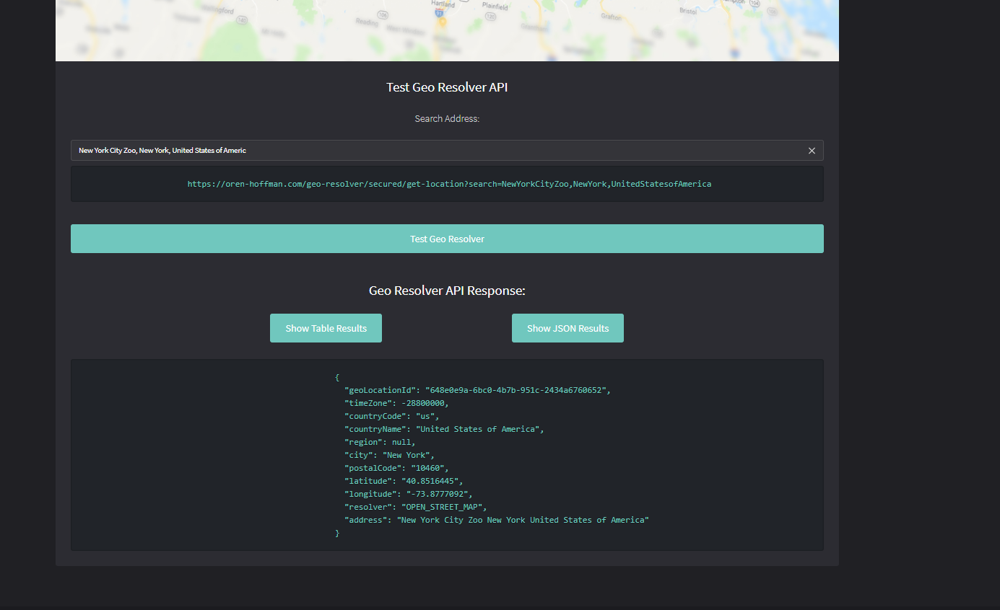
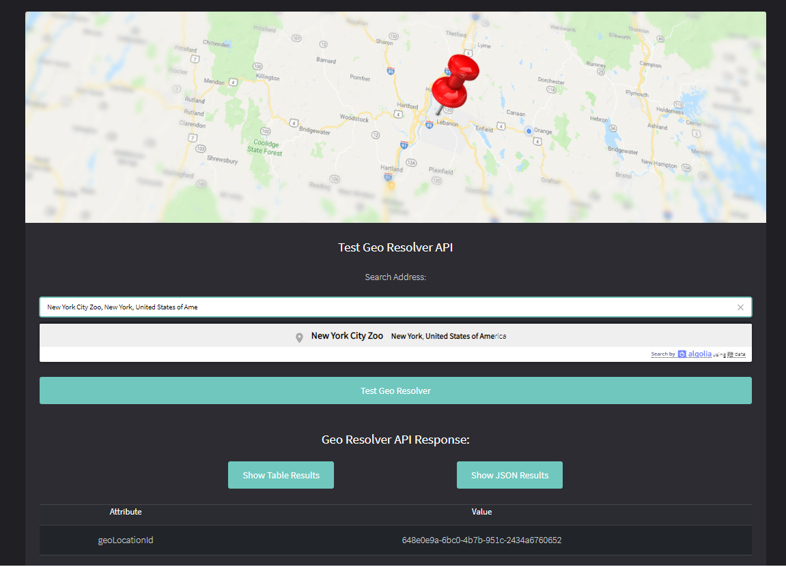

# Geo Resolver Application
Java Spring-Boot 2 application for Geolocation API services, originally designed for Gollgi.com and released in 2020 as an open source project.  
On API's invocation Geo-Resolver engine will retrieve the richest location results from a list of Geolocation providers.
Demo can be fpund in this link https://oren-hoffman.com/geo-resolver/

## Geo Resolver API REST Endpoints
- '/secured/get-location-by-resolver/{address}/{resolver}' 
    - This endpoint will produce Geolocation object by a given address and provider's name
        
    
- '/secured/get-location-by-resolver/{address}/{resolver}' 
    - This endpoint will produce Geolocation object by a given address and will produce the richest results from a list of Geolocation providers 
      
    
- '/secured/get-resolver' 
    - This endpoint will produce a list of all available Geolocation providers 
      

## Git Branches
- master - For deploying a Spring-Boot application as a Tomcat war/ Embedded Tomcat jar files
- geo-resolver-wildfly - For deploying a Spring-Boot application as a Wildfly/Jboss (or any other JEE application server) war file

# Module Major Dependencies
- Spring-Boot V2.3.1.RELEASE
- Spring-Data V2.0.0.RELEASE

# Server Specifications
- Java Maven project
- Spring-Boot
- Persistence - Spring-JPA-repository
- H2 embedded DB

# Client Specifications
- Angular V5
- Bootstrap 4

# Environment
 - Ubuntu/Windows
 
# Requirements
- JVM
- Full application build before running

## Build Application
- development
    - `$ mvn clean install -Pbuild-dev`
      
- Production
    - `$ mvn clean install -Pbuild-prod`
    
    
## Running Up Environment (After build completed)
- server
    - directory : `/geo-resolver/`
    - `$ mvn spring boot:run`
      
- client
    - directory : `/geo-resolver/angular-client`
    - `$ ng serve`

## Accessing UI
- Local: http://localhost:8080/
- Demo: https://oren-hoffman.com/geo-resolver/

## Images

# Contact
- For any questions you can send a mail to orenhoffman1777@gmail.com
